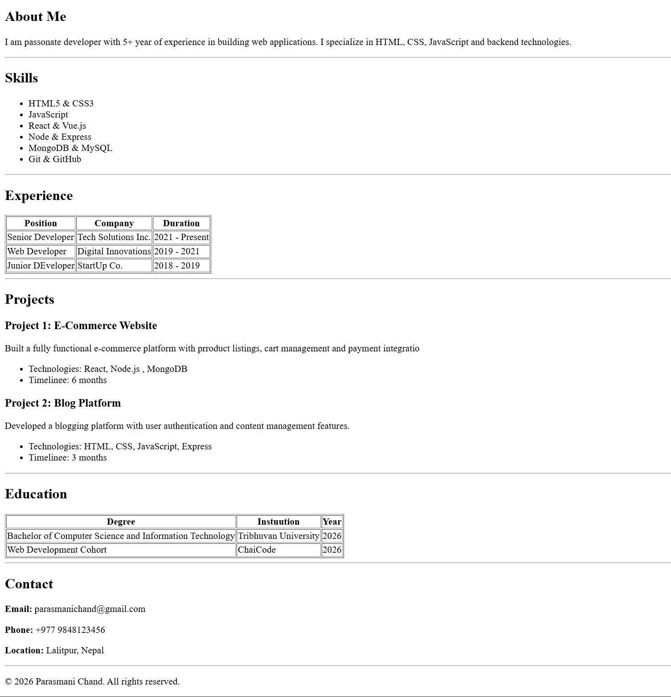

# My Resume (HTML)

This repository contains my personal resume built using **pure HTML only**.  
The goal of this project is to practice semantic HTML structure and present my resume in a simple, clean, and readable format without using CSS or JavaScript.

---

## 📄 About the Resume

The resume includes the following sections:

- Header with name and role
- About Me
- Skills
- Work Experience
- Projects
- Education
- Contact Information
- Footer

All content is written using basic and semantic HTML elements such as:
`header`, `main`, `section`, `article`, `table`, `ul`, and `footer`.

---

## 🛠 Technologies Used

- HTML5 only  
(no CSS, no JavaScript, no frameworks)

---

## 📂 Project Structure

    my-resume-26-html/
    │
    ├── resume-of-parasmani-chand.html
    └── README.md

---

## 🚀 How to View the Resume

1. Clone the repository:
   ```bash
   git clone https://github.com/parasmani-chand/my-resume-26-html.git

---

## 🖼 Resume Preview

Below is a preview of the resume rendered in a web browser:


